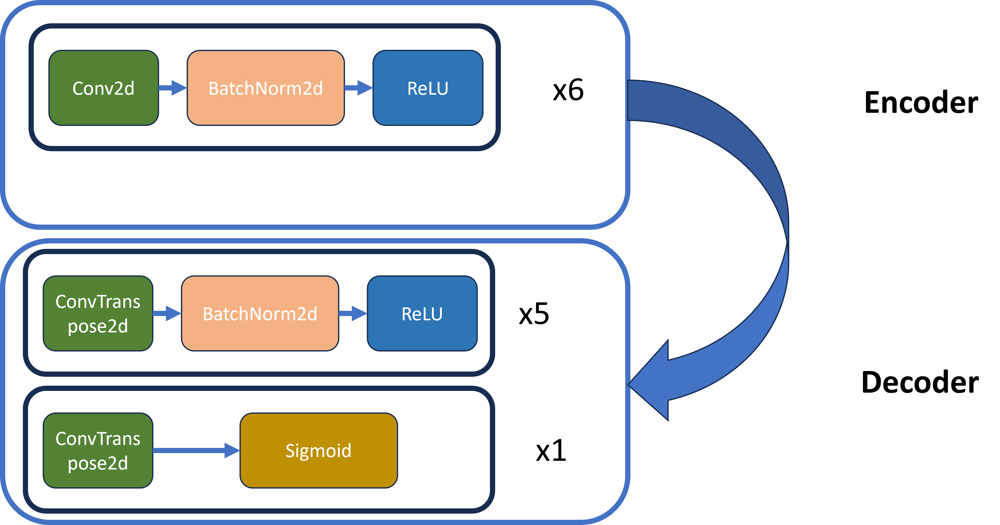

# Homework 5: Autoencoders and Representation Learning on Colored Shapes

## Submission instructions

* **Due date and time:** 12/09/2025 (midnight)
* **Carmen submission:**
  Submit a `.zip` file named `name.number.zip` (e.g., `chao.209.zip`) with the following:

  - your completed Python script `main.py`
  - your generated figures in `.png` format:
    - `samples_q1.png` (Q1: dataset visualization)
    - `layerwise_nn_acc.png` (Q3: layer-wise color/shape accuracy)
    - `nearest_neighbors.png` (Q3: nearest-neighbor grid)
  - your trained model checkpoint:
    - `autoencoder.pt` (saved in the output directory)
  - any additional result files you create for **Q4** (e.g., `layerwise_nn_acc_tuned.png`, short text/markdown report)

* **Collaboration:**  
  You may discuss the homework with your classmates, but you must write and submit your own code. Copying code or dividing the work and swapping solutions is **not** allowed.  
  At the very end of your `main.py`, list each classmate you discussed with, one per line, in the format:

  ```python
  # Discussion:
  # Wei-Lun Chao, chao.209
  # Ada Lovelace, lovelace.1
  ```

  Please consult the syllabus for the detailed collaboration policy.

---

## Implementation instructions

* Download or clone this repository.

* You will see a single Python script: **`main.py`**.

* After running the code, you will see:
  - a folder `data_folder` containing generated toy images (training set)
  - a folder `ae_runs` containing checkpoints and result figures

* Please use **Python 3** and **PyTorch** (with `torchvision`, `numpy`, and `matplotlib`) as already imported in the starter code. 
* **Do not change the function names, input arguments, or return types** of any functions marked with `#### Your job ... ####`. You may create helper functions if needed, as long as the main interface stays unchanged.

* Your code must run with the provided command-line arguments and default paths. It is your responsibility to ensure your final `main.py` executes end-to-end.

---

## Installation instructions

* You will need:

  - NumPy
  - PyTorch
  - torchvision
  - matplotlib
  - Pillow

* In a typical environment, you can install them with:
  ```bash
  pip install numpy torch torchvision matplotlib pillow
  ```
  (You may use `pip3` or `py -3 -mpip` depending on your OS.)

---

## Introduction

In this homework, you will:

1. Generate a synthetic dataset of simple colored shapes (circles, squares, triangles) on black backgrounds.
2. Implement and train a convolutional autoencoder on this dataset.
3. Investigate the learned representations by computing **nearest neighbor** accuracies for predicting **color** and **shape**.
4. (Q4) Improve the model and training pipeline to achieve **higher shape accuracy**.

The goal is to practice:

- Implementing basic image generation and datasets.
- Building convolutional encoder/decoder architectures in PyTorch.
- Using learned features for downstream tasks via simple k-nearest neighbors.
- Reasoning about representation quality and how architecture/training changes affect it.

Please also take a look at HW5.ppt or HW5.pdf

---

## Question 0: Get ready (no coding points)

* Open `main.py` and skim through the following functions/classes:

  - `draw_shape`, `create_dataset`, `plot_samples_grid`
  - `ColorShapeDataset`, `build_transform`, `build_dataloader`
  - `ConvAutoencoder`, `train_autoencoder`
  - `collect_embeddings`, `cross_nearest_neighbor_accuracy`
  - `save_nearest_neighbor_grid_cross`, `plot_layerwise_nn`, `evaluate`

* Note the global constants:
  - `SHAPES`, `COLORS`, `IMG_SIZE`, `N_SAMPLES`, `OUT_DIR`

* Unzip the `data_folder_test.zip` to get the test dataset folder `data_folder_test`.

There is nothing to submit for Question 0.

---

## Question 1: Generating colored shape images (30 pts)

In this question, you will complete the code that draws shapes and creates the training dataset.

### Tasks

* Complete the implementation of **`draw_shape(shape, color)`**. You should:

  - Create a circle, square, or triangle with a **random size** and **random position** (within the image) using the provided random scale and center.
  - Concretely, generate the training data with THREE SHAPES and EIGHT COLORS. You will be given the following 
    - s: scale for the shape 
    - cx and cy: the center of the shape 
    - Shapes:
      - Circle: Draw a circle centered at (cx, cy) with a diameter of s. Use d.ellipse(). 
      - Square: Draw a square centered at (cx, cy), with side length s, and rotated by a random angle. Use d.polygon(). 
      - Triangle:  Draw an equilateral triangle centered at (cx, cy), scaled by s, and rotated by a random angle. Use d.polygon().
  - Draw the shape in the given RGB color on a black background using Pillow (`ImageDraw`).

  Look for the region:

  ```python
  #### Your job 1 starts here ####
  ...
  #### Your job 1 ends here ####
  ```

  for each shape type.

* The function **`create_dataset()`** will call `draw_shape` multiple times to generate `N_SAMPLES` images and save them into `OUT_DIR` with filenames like:

  ```
  00001_circle_red.png
  00002_triangle_green.png
  ...
  ```

* The function **`plot_samples_grid`** will visualize one example per (color, shape) combination in an 8×3 grid and save it as `samples_q1.png`.

### Running and saving

After implementing `draw_shape`, run:

```bash
python3 main.py --job_number 1
```

This will:

- Generate `N_SAMPLES` training images in `data_folder/`
- Save a visualization grid `samples_q1.png` in the current directory

### What to submit for Q1

- `main.py` (with your `draw_shape` implementation)
- `samples_q1.png`

---

## Question 2: Building and training a convolutional autoencoder (80 pts)

In this question, you will implement the dataset class, dataloader, autoencoder, and training loop.

### Tasks

1. **Dataset & transforms (ColorShapeDataset)**

   Complete:

   - `ColorShapeDataset.__init__`
   - `ColorShapeDataset.__getitem__`
   - `build_dataloader(...)`

   Requirements:

   * `ColorShapeDataset` should:
     - Store the list of image paths.
     - Parse shape & color labels from the filename using `parse_labels`.
     - Load each image with `PIL.Image`, apply the transform, and return:
       ```
       img_tensor, shape_idx, color_idx
       ```
       where `img_tensor` is of shape `(3, IMG_SIZE, IMG_SIZE)`.

   * `build_dataloader`:
     - Instantiate a `ColorShapeDataset` with `build_transform()`.
     - Wrap it in a `DataLoader` with the given `batch_size`, `shuffle`, and `num_workers`.


2. **Convolutional autoencoder**

   Complete:

   - encoder construction in `ConvAutoencoder.__init__`
   - decoder construction in `ConvAutoencoder.__init__`
   - `encode` and `decode` methods

   Hints/constraints:

   * Use multiple (convolutional layers + BatchNorm + ReLU) for the encoder.
     * for the convolutions, use kernel size 3, stride 2, padding 1 to downsample by a factor of 2 at each layer.
   * Use (transpose convolutions + BatchNorm + ReLU) for the decoder to recover the input size.
     * for the transfose convolutions, use kernel size 4, stride 2, padding 1 to upsample by a factor of 2 at each layer.
     * in the last layer, instead of using BatchNorm + ReLU, use a `Sigmoid` activation to ensure output pixel values are in [0, 1].
   * The provided `enc_channels` and `dec_channels` lists specify the number of channels at each stage.
   * `encode(x, return_intermediate=True)` should return the final latent tensor and a list of intermediate activations (one per encoder layer), which will be used later in Q3.

	Model architecture visualization:

	


3. **Training the autoencoder**

   Complete:

   - `train_autoencoder(model, train_loader, device, epochs, lr, weight_decay, checkpoint_path)`

   Requirements:

   * Use an `Adam` optimizer.
   * Use mean squared error (MSE) reconstruction loss between the input and output images.
   * Train for the specified number of epochs.
   * Print training loss periodically.
   * At the end, save the model weights to `checkpoint_path` (already provided).

### Running and saving

After implementing the above, run:

```bash
python3 main.py     --job_number 2     --data-dir data_folder     --output-dir ae_runs     --epochs 20     --batch-size 128     --lr 1e-3     --wd 1e-5
```

This will:

- Build the training dataloader from `data_folder`
- Train the autoencoder
- Save a checkpoint `ae_runs/autoencoder.pt`

### What to submit for Q2

- `main.py` (with completed dataset, dataloader, and autoencoder code)
- `ae_runs/autoencoder.pt`

(Optionally, you may also submit any reconstruction visualization figure you generate.)

---

## Question 3: Probing representations with nearest neighbors (30 pts)

In this question, you will use the trained autoencoder as a feature extractor and analyze how well different layers encode **color** and **shape**.

### Tasks

1. **Collect embeddings**

   Complete the marked part in:

   - `collect_embeddings(model, loader, device)`

   Requirements:

   * For each batch, you should:
     - Store the **raw pixels** (flattened input) into `features['pixels']`.
     - Run the encoder and collect outputs from each encoder layer into `features['layer_1']`, `features['layer_2']`, ..., `features['layer_L']`.
   * Also collect the shape and color labels from the dataset into `shapes` and `colors`.
   * At the end, concatenate tensors along the batch dimension.

2. **Nearest neighbor grids**

   Complete:

   - `save_nearest_neighbor_grid_cross(...)`

   Requirements:

   * Calculate the distance between all the data points between `query_embeddings` and `ref_embeddings `.
   * For the distance, please use cosine distance, that is, pre-normalize each vector to have its L2 norm equal to 1, and compute the L2 distance
   * For each query, find its nearest neighbors' indices `nn_indices` in the reference embeddings using the `dist` you calculated in the previous step.
   
   

3. **Layer-wise color/shape accuracy plots**

   Complete:

   - `plot_layerwise_nn(color_accs, shape_accs, out_path)`

   Requirements:

   * Plot two lines as a function of layer index (x-axis = `["pixels", "layer_1", ..., "layer_L"]`):
     - color 1-NN accuracy
     - shape 1-NN accuracy
   * Add appropriate axis labels, legend, and markers like the example below.
   * Save the plot to `out_path`.
   
   

4. **Evaluate function**

   In `evaluate(...)`, fill in the loop over layers:

   ```python
   for layer_name in layer_order:
       ...
   ```

   Requirements:

   * For each layer, take the corresponding feature tensors from `features_train` and `features_test`.
   * Use `cross_nearest_neighbor_accuracy` to compute:
     - color accuracy (using `colors_train`, `colors_test`)
     - shape accuracy (using `shapes_train`, `shapes_test`)
   * Append results to `color_accs` and `shape_accs`, and optionally print them.

### Running and saving

After training an autoencoder (Q2), run:

```bash
python3 main.py     --job_number 3     --data-dir data_folder     --test-data-dir data_folder_test     --output-dir ae_runs     --batch-size 256
```

This will:

- Load `ae_runs/autoencoder.pt`
- Collect embeddings on a subset of train images and on the test images
- Compute 1-NN color and shape accuracy for each layer
- Save:
  - `ae_runs/layerwise_nn_acc.png`
  - `ae_runs/nearest_neighbors.png`

### What to submit for Q3

- `main.py` (with completed Q3 functions)
- `ae_runs/layerwise_nn_acc.png`
- `ae_runs/nearest_neighbors.png`

---

## Question 4: Improving shape accuracy (bonus/open-ended, 20 pts)

In this question, you are free to **change anything you want** in the **training pipeline or architecture** to achieve **higher shape 1-NN accuracy**, **with one critical constraint**:

> You **must NOT** use any images from the **test set** (`data_folder_test`) for training. You** should NOT** do any **supervised** training using **labels** from the training data


### Examples of allowed changes

You may, for example:

* Modify the autoencoder architecture
* Change the training setup
* Change the training set or add data augmentations

### Not allowed
* Using any images from `data_folder_test` in training.
* Supervised training using labels from the training data


### What to submit for Q4

* Create a new file `main_q4.py` with your solution, but ensure to use all the evaluation code we provided.
* At least one figure or text file summarizing your best result, e.g.:
  - `ae_runs/layerwise_nn_acc_tuned.png`
* A short description (a text/markdown file) explaining:
  - What you changed
  - Why you think it helps
  - The resulting shape accuracy for the best model

---

## What to submit (summary)

Your final `.zip` should contain:

* `main.py` (and optionally `main_q4.py` for Q4)
* Figures:
  - `samples_q1.png`
  - `ae_runs/layerwise_nn_acc.png`
  - `ae_runs/nearest_neighbors.png`
  - Any additional Q4 figures (e.g., `layerwise_nn_acc_tuned.png`)
* Checkpoint:
  - `ae_runs/autoencoder.pt`
* A short explanation for Q4 (if you attempted it).

Make sure your code runs with the commands shown above in a fresh environment.
